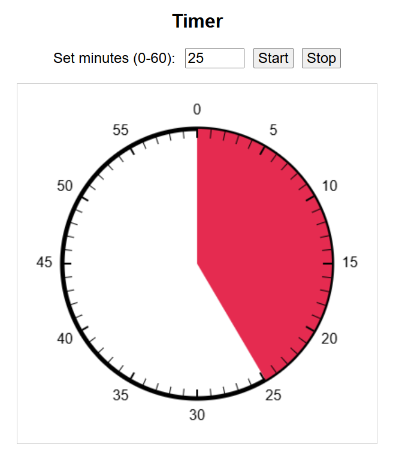

# Timer

A simple visual timer web app that helps track time.

## Features
- Set a timer between 0 to 60 minutes.
- Visual countdown using a red sector that shrinks over time.
- Start and stop buttons for timer control.
- Clear, easy-to-read minute markers.

## How It Works
1. Enter the desired minutes (0-60) in the input field.
2. Click the **Start** button to begin the countdown.
3. The red area on the dial will shrink as time passes.
4. Click the **Stop** button to halt the timer at any time.

## Usage
```bash
# Clone the repository: 
git clone https://github.com/mario-gellrich-zhaw/python_timer

# Open a terminal (e.g. inside VS Code), cd into the folder python_timer and run:
python app.py

# Access the timer by following the link provided, e.g.: http://127.0.0.1:5000.
```

## Technologies Use
- Python
- Flask
- HTML5
- CSS
- JavaScript
- Canvas API for rendering the visual timer

## Installation
Install Python and the Python library flask on your computer (virtualenv recommended).

## Code Overview
The timer is implemented using the HTML5 `<canvas>` element, with JavaScript handling:
- Drawing the circular timer.
- Updating the red countdown sector.
- Managing user input for the timer duration.
- Starting and stopping the timer interval.

## Screenshot


## Author
Developed by Dr. Mario Gellrich.

---

Enjoy using the **Timer** for productivit or study sessions!
